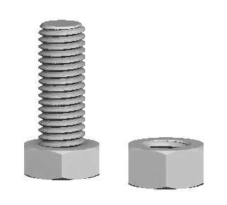
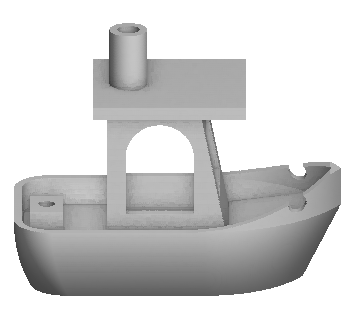
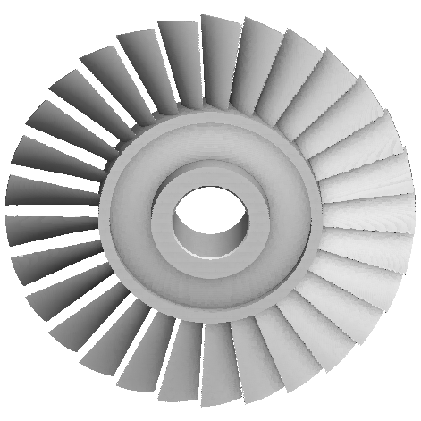

# scratchcad

> [!WARNING]
> scratchcad is under active development. APIs, tools and script syntax may
> change without notice, and things may break between commits.

scratchcad is a rust based solid modelling API, plus an MCP server so AI assistants
can use it.

## Quick start (requires docker)

Clone the repo and check out the
[latest release](https://github.com/Zesuperaker/scratchcad/releases/latest).
`main` moves fast and may be broken between releases.

<!-- x-release-please-start-version -->
```sh
git clone --branch v0.1.1 https://github.com/Zesuperaker/scratchcad.git
cd scratchcad
```
<!-- x-release-please-end -->

Then start the server and the MCP server:

```sh
docker compose up --build        # or `docker compose watch` to reload on edits
```

The mcp is already configured localy through .mcp.json

For clients that don't support .mcp.json, point them at `http://localhost:8000/mcp` using the
streamable HTTP transport.

## Examples

| prompt (using opus 5.5 medium through cc) | output |
|---|---|
| Create an M10 hex bolt with 26 mm thread length, a course pitch of 1.5 mm and head height 6.4 mm. Also create a matching hex nut with 8.4 mm height. Both of these should be in the same file displayed beside each other. |  |
| Create a 3DBenchy. |  |
|Create a mid-stage compressor blisk with these dimensions: an outer tip diameter of 440 mm, a hub platform diameter of 241.2 mm, and a radial blade span of 99.4 mm across its 29 twisted aerodynamic airfoils. Mechanically, the component is defined by an 80.0 mm shaft interface bore diameter, an axial hub length of 77.5 mm, and an airfoil rim width of 45.0 mm, with rear mounting flange diameters measuring 184 mm at the inner shoulder and 202 mm at the outer rim. Blade count of 29 twisted aerodynamic airfoils. |  |

## Docker info

`compose.yaml` runs both dev images:

| service | port | image |
|---|---|---|
| `server` | `127.0.0.1:8080` | [`server/Dockerfile.dev`](server/Dockerfile.dev): `cargo run` with fast incremental rebuilds |
| `mcp` | `127.0.0.1:8000` | [`mcp/Dockerfile.dev`](mcp/Dockerfile.dev): the MCP server over streamable HTTP at `/mcp` |

Run the MCP checks inside its container with
`docker compose run --rm mcp uv run pytest`.

With `docker compose watch`, edits
under `server/src` or `mcp/src` restart the affected container (the Rust
side recompiles in a few seconds), and changes to `Cargo.toml`, `Cargo.lock`,
`pyproject.toml` or `uv.lock` rebuild its image. To require an API token, put
`SCRATCHCAD_API_TOKEN=<16+ characters>` in a `.env` file next to `compose.yaml`.

## STL outputs

Exported STL files appear in `./output`. These will be the main file that you recieve from the agent unless you also explicitly ask for the Rhai script that the agent created to be saved to `./output`.  

## Architecture 

| directory | what it is |
|---|---|
| [`server/`](server) | The scratchcad HTTP service (Rust 1.98, [Fidget](https://github.com/mkeeter/fidget) + axum). Validates, evaluates, renders and meshes [Rhai](https://rhai.rs) scripts that describe implicit surfaces. |
| [`mcp/`](mcp) | An [MCP](https://modelcontextprotocol.io) server (Python 3.14, [FastMCP](https://gofastmcp.com)) that exposes the service's five endpoints as tools, so a model can write a script, look at renders, measure the part and export an STL. |

The two are independent: the MCP server talks to the service over HTTP, so it
works with a local build, the dev containers, or a deployed instance.

## License

scratchcad is licensed under the [Apache License 2.0](LICENSE). Its dependencies, are listed
with their licenses in [`THIRD_PARTY_LICENSES.txt`](THIRD_PARTY_LICENSES.txt).

## Shoutout 

A huge shoutout to Matt Keeter the developer of [Fidget](https://github.com/mkeeter/fidget), scratchcad uses fidget as the core implicit kernal and this project would not be possible without fidget.
